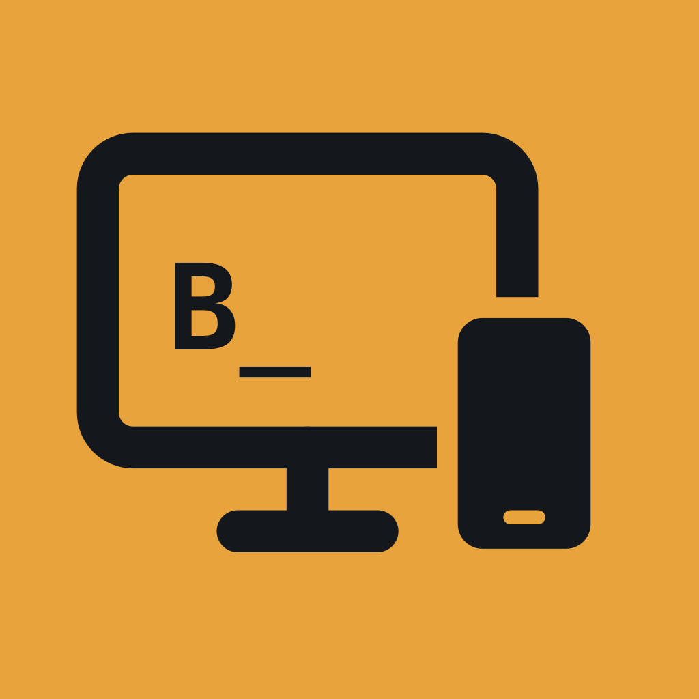

<div align="center">



# brunOS\_

**Un escritorio en el monitor, servido por el iPhone.**

</div>

BrunOS convierte un iPhone en un ordenador de sobremesa: conectas un monitor, una tele o un
proyector por USB-C, emparejas ratón y teclado Bluetooth, y trabajas en una pantalla de verdad.

No es duplicar la pantalla del teléfono. BrunOS **dibuja directamente en la pantalla externa a su
resolución nativa**, con su propio escritorio de ventanas en mosaico o flotantes, sin bandas negras y sin la
silueta de un iPhone en mitad del monitor. El teléfono se queda de mando: trackpad de emergencia,
teclado en pantalla, dictado y ajustes.

Es un proyecto personal. No está en la App Store ni va a estarlo.

## Funciones

| | Estado |
| --- | --- |
| **Pantalla externa** a resolución nativa, con escalas 1×–3×, overscan y perfiles por monitor | ✅ |
| **Ratón y teclado** Bluetooth, cursor propio que no se atasca en los bordes, atajos | ✅ |
| **Escritorio** en mosaico estilo i3 o con ventanas flotantes, 3 espacios, dock y pantalla completa | 🚧 flotantes sin rodaje |
| **Modo claro y oscuro**, siguiendo al iPhone o fijo, con fondos que cambian con él | ✅ |
| **Terminal SSH** por Tailscale, contraseña o clave ed25519, con tmux, búsqueda y `known_hosts` | ✅ |
| **Navegador** con pestañas, bloqueo de anuncios editable, descargas y contraseñas de iOS | ✅ YouTube probado |
| **Favoritos** con barra propia, iconos de cada sitio, sugerencias al escribir y modo lectura | 🚧 sin rodaje |
| **Descargar vídeos** de la página, con progreso, y guardar la página como PDF | 🚧 sin rodaje |
| **Ficheros**: iPhone, iCloud, USB, SMB y SFTP, con vistas, vista previa, copiar carpetas y arrastrar | 🚧 a falta de rodaje |
| **Lanzador** (Cmd+P) y **búsqueda** (Cmd+F) en todos los paneles | 🚧 a falta de rodaje |

El escritorio, el ratón, el teclado, la conexión SSH y el navegador están probados con un monitor
de verdad. Lo más reciente —ventanas flotantes, arrastrar ficheros, el lanzador— está escrito y
compilado, pero sin rodaje.

Cada panel lleva los tres botones de macOS: **rojo** cierra, **amarillo** lo manda al dock y
**verde** lo pone a pantalla completa. Los ajustes globales están en la rueda del dock, y los de
cada panel en la rueda de su propia barra.

**Con el monitor conectado, el iPhone se apaga** y queda como superficie táctil: todo —ajustes
incluidos— se maneja desde el monitor. No es estético, es necesario: con AssistiveTouch, el botón
izquierdo del ratón se convierte en un toque sobre la pantalla del teléfono, así que cualquier
control que hubiera allí se llevaría los clics que iban al escritorio.

## Requisitos

- **iPhone 15 o posterior con USB-C.** Los modelos **e** y el **Air** no valen.
- **iOS 27** o posterior.
- Un monitor, tele o proyector por USB-C, y ratón y teclado Bluetooth.
- **AssistiveTouch activado**: en el iPhone el ratón Bluetooth sólo funciona con él encendido, y
  ninguna app puede activarlo por API. BrunOS trae un asistente que guía para automatizarlo con
  Atajos.

## Compilar

Hace falta Xcode 27 y [XcodeGen](https://github.com/yonaskolb/XcodeGen).

```bash
brew install xcodegen
xcodebuild -downloadComponent MetalToolchain   # lo pide SwiftTerm y no viene con Xcode
cp Local.xcconfig.example Local.xcconfig       # y pon tu DEVELOPMENT_TEAM
./Tools/build.sh
```

Opcionales, porque lo que descargan no se versiona:

```bash
./Tools/fetch-wallpapers.sh    # copia los fondos de macOS de tu propio Mac
./Tools/fetch-blocklists.sh    # descarga EasyList y EasyPrivacy y las convierte
```

El `.xcodeproj` **no está versionado**: lo genera XcodeGen desde `project.yml`. El equipo de firma
va en `Local.xcconfig`, que tampoco se versiona, para no meter datos de la cuenta de desarrollador
en un repositorio público.

## Instalar por TestFlight

```bash
./Tools/testflight.sh --dry-run   # comprueba que encuentra todo
./Tools/testflight.sh             # archiva, firma y sube a App Store Connect
```

Hace falta una clave de la API de App Store Connect, que **no está en el repositorio**: el `.p8`
en `~/.appstoreconnect/private_keys/` y su ID y el del emisor en
`~/.config/appstoreconnect/testflight.env`. El número de build es la fecha y la hora. Como tester
interno, la build no pasa por la revisión de Apple.

## Limitaciones conocidas

Son de iOS, no del programa, y no hay intención de pelearse con ellas:

- **No se pueden mostrar otras apps de iOS** en la pantalla externa. Sólo BrunOS.
- **En segundo plano, iOS vuelve a duplicar la pantalla.** La app tiene que quedarse delante.
- **El círculo del puntero de AssistiveTouch no se puede ocultar.**
- **Los clics sintéticos no entran en iframes de otro dominio** (avisos de cookies, pasarelas de
  pago, logins de terceros): la política del mismo origen impide llegar a ellos.
- **Las contraseñas de Safari se eligen tocando el iPhone**: iOS sólo las ofrece en su teclado,
  sobre un campo nativo. Al pinchar un campo de acceso en una web, sale en el teléfono.
- **El contenido con DRM puede salir en negro** en la salida externa.
- **El botón izquierdo del ratón no llega a la app como tal**: con AssistiveTouch, iOS lo convierte
  en un toque en la pantalla del teléfono. Por eso, con monitor conectado, todo el iPhone hace de
  trackpad.
- **La velocidad del ratón se ajusta en iOS** (Accesibilidad › Control del puntero): el cursor del
  monitor sigue la posición del puntero del iPhone, así que la pone el sistema.
- **El fondo de pantalla del iPhone no se puede reutilizar**: iOS no se lo enseña a las apps.
- **`keyboard-interactive` no funciona**: la librería SSH que usa BrunOS no habla ese método. Los
  servidores configurados sólo con él no admitirán la contraseña.

## Licencia

El código de BrunOS es [MIT](LICENSE).

Software de terceros:

- [SwiftTerm](https://github.com/migueldeicaza/SwiftTerm) — MIT
- [Citadel](https://github.com/orlandos-nl/Citadel) — MIT, fijado a la serie 0.11
- [AMSMB2](https://github.com/amosavian/AMSMB2), con [libsmb2](https://github.com/sahlberg/libsmb2) dentro — LGPL 2.1, enlazada como librería dinámica
- [JetBrains Mono](https://github.com/JetBrains/JetBrainsMono) — SIL Open Font License 1.1
- [IBM Plex Sans](https://github.com/IBM/plex) — SIL Open Font License 1.1

Las listas de bloqueo **EasyList** y **EasyPrivacy** tienen licencia propia y **no se redistribuyen
en este repositorio**: un script de `Tools/` las descarga y las convierte en local, y lo generado
está en `.gitignore`.

Lo mismo con los **fondos de macOS**: son de Apple, y `Tools/fetch-wallpapers.sh` los copia desde
tu propio Mac sin que salgan de él. Los degradados que trae BrunOS de serie se dibujan por código
y no dependen de nada.
